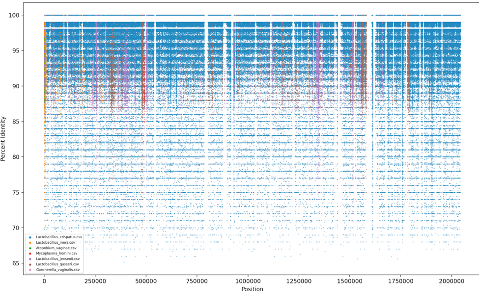

# About the Project

Used for 
### Generating Fragment Recruitment Plot for Vaginal Metagenomic Samples

-	The ratio of number of bacterial cells to human cells is 10:1. It is undeniable that normal flora at body sites help in various functions
-	Amidst other functions, vaginal microbiome helps in maintaining pH to make the environment non-habitable to pathogens 
-	Fragment recruitment plot will help to assess alignment of metagenomic reads on the reference genomes of bacteria
Methods and Materials:
-	Metagenomic Sequences: Metagenomic sample was collected from Vaginal Introitus and Mid-Vagina from Human Microbiome Project
-	Reference Genomes: 10 Bacterial reference genomes which are likely to be in the habitat, such as, L. crispatus, L. iners were collected
-	Aligned metagenomic reads sampled from Vaginal Introitus and Mid- Vagina on bacterial reference genome using Bowtie2. 
-	Developed a program named ‘SAMfile.py’ to calculated percent identity of each aligned read-- filter for aligned reads, MD:Z, calculate % identity, plot
-	‘Fragrecruit.py’ uses the CSV file generated by ‘SAMfile.py’ to plot

Codes: `samfile.py`

To generate percent identity from the SAM file, matches and mismatches of alignments that aligned to the reference is calculated. For that, the “MD:Z:*” optional parameter is used which is only present when reads are aligned. Percent identity was calculated with the following formula:
Percent identity= matches/ (matches+mismatches)*100
The result is in CSV file format with three columns- 
1.	Column 1: Name
2.	Column 2: Position
3.	Column 3: Percent Identity

Fragrecuit.py

This code inputs above created CSV file and used position of the read and percent identity to generate fragment recruitment plot using Python library- matplotlib

### Fragment Recruitment Plot
-	Fragment Recruitment plot parses alignment score for each read to show identity of each read with the reference genome
-	X axis: position in genome
-	Y axis: percent identity

